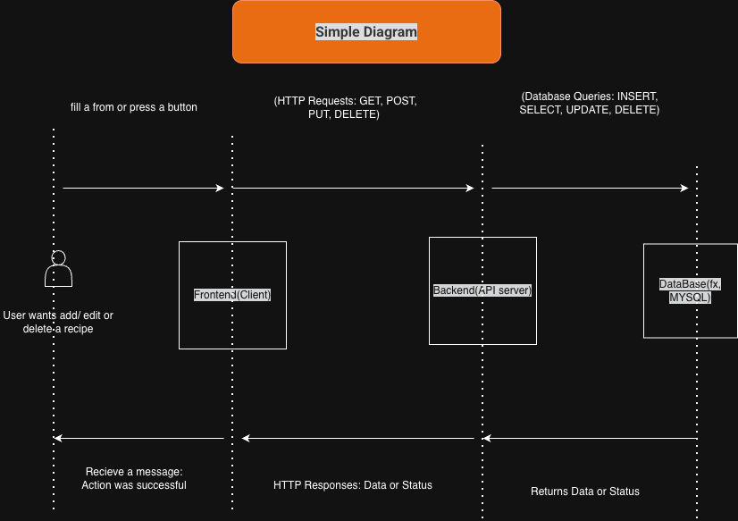
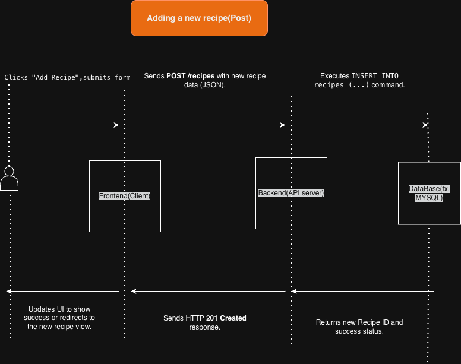
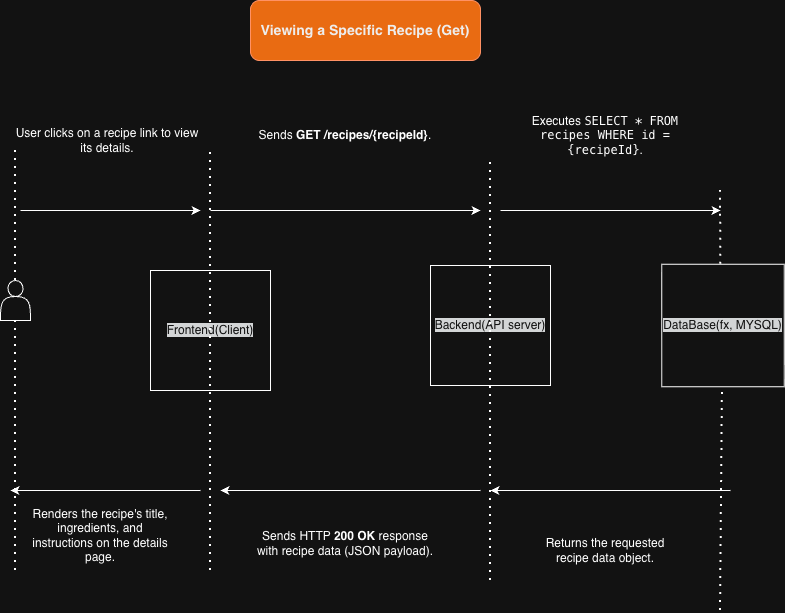
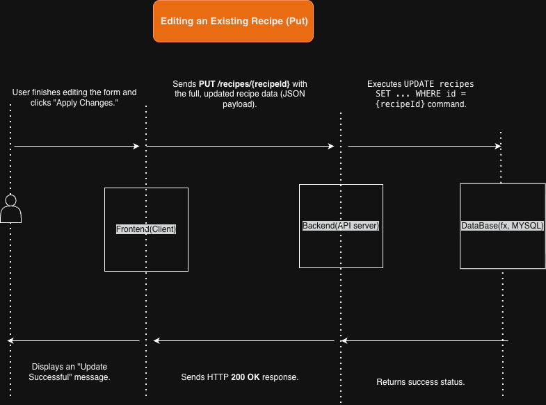

### **Recipe Collection App – Architecture & Sequence Diagrams**

## **1. Architecture Diagram (Simple Text-Based)**

### **Component Explanations**

* **Frontend:** The page where the user views, adds, and edits recipes.
* **Backend:** The server that receives frontend requests and handles CRUD operations.
* **Database:** The place where recipes (title, ingredients, instructions) are permanently stored.
* **Communication:** The frontend and backend communicate through HTTP requests (GET, POST, PUT, DELETE).

---

## **2. HTTP Methods for Create / View / Edith & Delete a recipe**

### **A) Add Recipe (POST /recipes)**

* User → Frontend: Clicks "Add Recipe"
* Frontend → Backend: `POST /recipes` {title, ingredients, instructions}
* Backend → Database: INSERT new recipe
* Database → Backend: Success
* Backend → Frontend: **201 Created** (Success Response)
* Frontend → User: Show success message / update recipe list

---

### **B) View Recipe (GET /recipes/:id)**

* User → Frontend: Clicks on a specific recipe
* Frontend → Backend: `GET /recipes/:id`
* Backend → Database: SELECT recipe WHERE id = ...
* Database → Backend: Return recipe data
* Backend → Frontend: Sends recipe details
* Frontend → User: Display recipe content

---

### **C) Edit Recipe (PUT /recipes/:id)**

* User → Frontend: Clicks "Edit Recipe" and updates fields
* Frontend → Backend: `PUT /recipes/:id` {updated data}
* Backend → Database: UPDATE recipe WHERE id = ...
* Database → Backend: Success
* Backend → Frontend: **200 OK**
* Frontend → User: Show updated recipe

---

## **3.Brief explanations of each component**
### **Where is the recipe data stored?**

The recipe information (title, ingredients, instructions) is saved in the Database.
The Backend talks to the database and handles all actions like adding, reading, updating, or deleting recipes.

### **How does the frontend communicate with the backend?**

The Frontend sends requests to the Backend using HTTP.
These are simple web requests like GET, POST, PUT, and DELETE.
In JavaScript, this is usually done with the fetch() function.

### **What happens when a user adds a new recipe?**

* The user fills out a form on the website and clicks “Save.”

* The Frontend collects the form data and sends it to the Backend using a POST request.

* The Backend receives the data, checks if it is valid, and prepares a command to save it in the Database.

* The Database stores the new recipe permanently.

* The Backend sends back a success message (like 201 Created).

* The Frontend updates the page to show the new recipe.

## **4.Sequence diagrams for the three user flows**

### **A) Add Recipe (POST /recipes)**

### **B) View Recipe (GET /recipes/:id)**

### **C) Edit Recipe (PUT /recipes/:id)**

